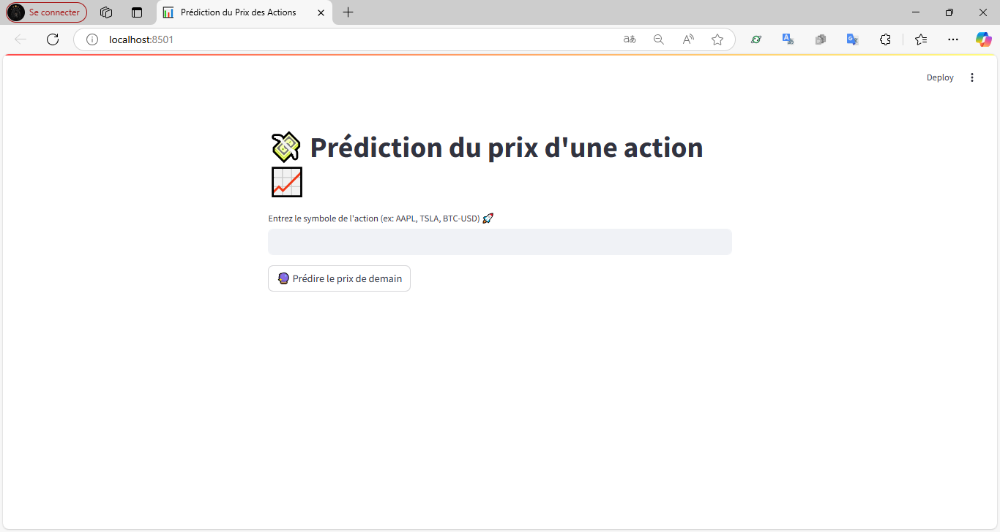
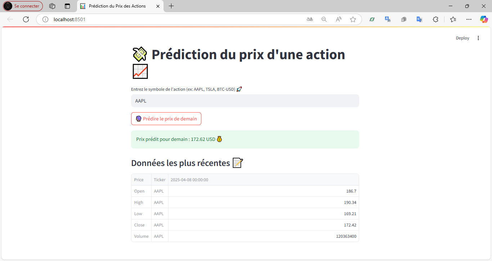
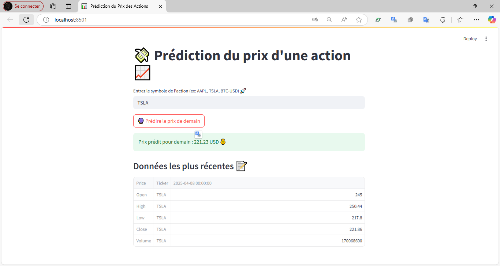
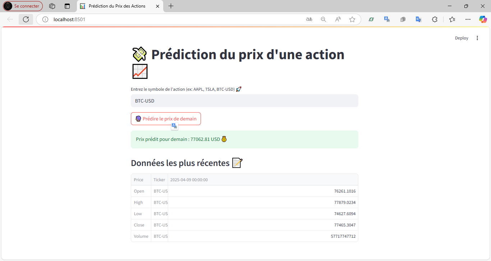

# Stock Price Predictor

Une application web simple utilisant **Streamlit**, **Scikit-learn** et **Yahoo Finance API** pour prédire le prix d'une action (comme AAPL, TSLA ou BTC-USD) pour le jour suivant, à l’aide d’un modèle de régression linéaire.

##  Fonctionnalités

- Téléchargement automatique des données boursières via `yfinance`
- Entraînement d'un modèle de prédiction (régression linéaire)
- Interface simple et intuitive avec `Streamlit`
-  Affichage de la prédiction + données les plus récentes

## Interface utilisateur (Screenshots)

###  Interface principale


###  Exemple de prédiction avec AAPL


###  Exemple avec TSLA


###  Exemple avec BTC-USD



## Comment exécuter le projet

###  Prérequis
- Python 3.x
- `pip` installé

### Installation des dépendances


pip install -r requirements.txt

### Lancer l'application
```bash
streamlit run app.py
